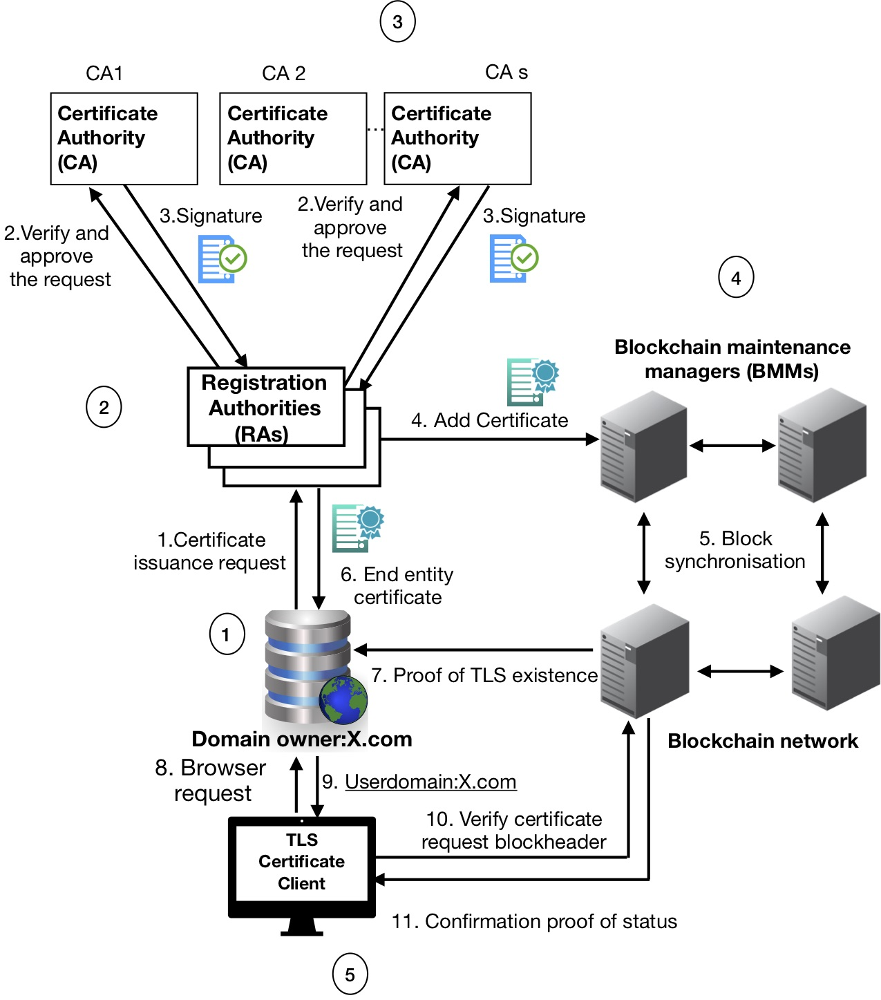

# BB-PKI: Blockchain-Based Public KeyInfrastructure Certificate Management

## A Proof-of-Concept Implementation for the BB-PKI protocol

BB-PKI is a certificate  management  system  that  addresses  the  security vulnerabilities as a result of impersonation attacks, causing CA misbehaviour due to weakest-link security problem at RAs in the  current  PKI.  The  main  aim  of  BB-PKI  is  not  to  detect impersonation  attacks  against  RAs;  rather,  it  prevents such attacks from happening by imposing manifold RAs as well as CAs to vouch and sign the certificates. Certificate Issuance Request (CIR) should be vouched by manifold RAs. Multiple CAs shall sign and issue the certificate  using  an  out-of-band  secure  communication  channel. Any  RA  that  contributes  to  the  verification  process  of  a  user’s request can publish the certificate in the blockchain by creating a  smart  contract  certificate  transaction.  BB-PKI  offers  strong security  guarantees,  compromising n−1of  the  RAs  or  CAs is  not  enough  to  launch  impersonation  attacks,  meaning  that attackers  cannot  compromise  more  than  the  threshold  of  the latter  signatures  to  launch  an  attack.

## Getting Started

In this repository we implement a prototype of BB-PKI. The general architecture of BB-PKI is depicted in the below Figure.



### Prerequisites

In order to deploy the BB-PKI, to add and revoke the certificate in the blockchain require to setup testnet in Ethereum network. 

### Installing

A step by step series of examples that tell you how to get a development of the system running

Steps 1: Generate x509 certificates and GPG certificates with Ethereum address

X509 certificates:
```
# 1. Generate CA's key
$ openssl genrsa -out ca.key 2048
.
.
.
.

## Contributing
 
This project is licensed under the MIT License - see the [LICENSE.md](LICENSE.md) file for details

## Acknowledgments

* Hat tip to anyone whose code was used
* Inspiration
* etc


